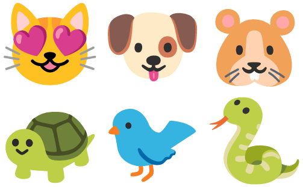

# deep-learning-eclipse-collections

A Groovy script inspired by:
https://github.com/eclipse/eclipse-collections-kata/tree/master/pet-kata-solutions

Full blog post:
https://blogs.apache.org/groovy/entry/deep-learning-and-eclipse-collections
